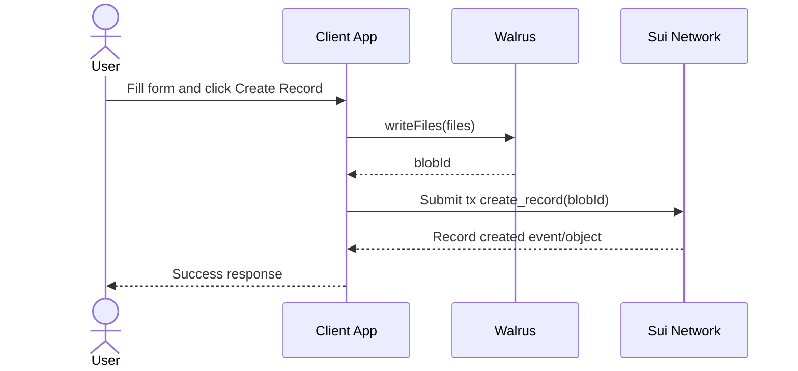

# System Architecture

## Table of Contents

1. [Record](#record)
   - [Overview](#overview)
   - [Digrams](#digrams)
   - [Smart Contract](#move)
2. [Reference](#reference)

## Record

### Overview

This section describes the end-to-end user flow for uploading files and creating a record. Users can select and upload multiple files the current implementation supports up to 660 files per upload.

- **User:**
  - click the Create Record button.
  - displays a form with the following required inputs:
    - Title: `string`
    - Description: `string`
    - Categories: `string[]`
    - Documents: `file[]` (Supported formats: .csv, .docx, .pdf, .png)

- **Behind the scene**
  - Calls writeFiles to create a blob on Walrus:

    > This flow consists of three internal steps. Once the blobId is received, the process continues to CreateRecord.

    ```ts
    const keypair = await getFundedKeypair();

    const files = [
      WalrusFile.from({
        contents: new TextEncoder().encode("test 1!"),
        identifier: "test1",
      }),
      WalrusFile.from({
        contents: new TextEncoder().encode("test 2!"),
        identifier: "test2",
      }),
    ];

    const quilt: {
      id: string;
      blobId: string;
      blobObject: {
        id: {
          id: string;
        };
      };
    }[] = await client.walrus.writeFiles({
      files,
      deletable: true,
      epochs: 3,
      signer: keypair,
    });

    const blobId = quilt[0].blobObject.id.id);
    console.log(blobId);
    ```

  - Creates a Sui transaction to call create_record:

    > Create a record only after blobId exists.

    ```ts
    import { Transaction } from "@mysten/sui/transactions";

    const tx = new Transaction();

    tx.moveCall({
      package: GAME_PACKAGE_ID,
      module: "module_game",
      function: "create_record",
      arguments: [tx.pure.u256(blobId), tx.object.clock()],
    });
    ```

  - Success Response: The Record object is created on-chain and returned to the client.

  - Commit New Record (Optional):

    > This flow executes when updating documents. It requires an existing record from `create_record` to act as the root.

    ```ts
    import { Transaction } from "@mysten/sui/transactions";

    const tx = new Transaction();

    const root_id = "0x0";
    const parent_id = "0x0";

    tx.moveCall({
      package: GAME_PACKAGE_ID,
      module: "module_game",
      function: "commit_record",
      arguments: [
        tx.object(root_id),
        tx.object(parent_id),
        tx.pure.u256(blobId),
        tx.object.clock(),
      ],
    });
    ```

- **Business Rules**
  - Maximum limit: 660 files per upload.
  - Each uploaded file must use a unique combination of identifier and format (e.g., file-a.pdf, file-b.pdf) within the Walrus write flow.

### Digrams



### MOVE

```move
public struct Record has key {
    id: UID,
    blob_id: u256,
    root_id: Option<ID>,
    parent_id: Option<ID>,
    creator: address,
    created_at: u64,
}

public struct RecordEvent has copy, drop {
    record_id: ID,
    blob_id: u256,
    root_id: Option<ID>,
    parent_id: Option<ID>,
    creator: address,
    created_at: u64,
}

public fun create_record(blob_id: u256, clock: &Clock, ctx: &mut TxContext) {}

public fun commit_record(record_root: &Record, record_parent: &Record, blob_id: u256, clock: &Clock, ctx: &mut TxContext) {}

fun check_role(record_parent: &Record, role: vector<u8>, ctx: &TxContext) {}

public fun remove_contributor(record: &mut Record, ctx: &mut TxContext) {}

public fun add_contributor(record: &mut Record, role: vector<u8>, ctx: &mut TxContext) {}
```

## Reference

- https://docs.wal.app/docs/walrus-client/quilts
- https://testnet.suivision.xyz/package/0xa998b8719ca1c0a6dc4e24a859bbb39f5477417f71885fbf2967a6510f699144?tab=Code
- https://github.com/CommandOSSLabs/walrus-ai-policy
- https://github.com/MystenLabs/walrus/blob/main/contracts/walrus/sources/system/metadata.move
- https://github.com/MystenLabs/ts-sdks/blob/main/packages/walrus/examples/quilt/write-blob.ts
- https://testnet.suivision.xyz/object/0x41b77efa33419fdc0ac213bc9ff62c28702e34097dc907598de30d1737deaae1
